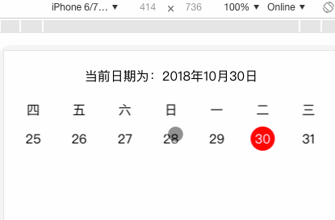

## 功能简介

主要实现单行横向滚动当月日期和星期的功能，滚动功能依赖swiper组件，具体项目逻辑在src/view/index/index.js,欢迎批评和指正共同进步；


##功能演示




## Project setup
```
npm install
```

### Compiles and hot-reloads for development
```
npm run dev index
```

### Compiles and minifies for production
```
npm run build index
```


